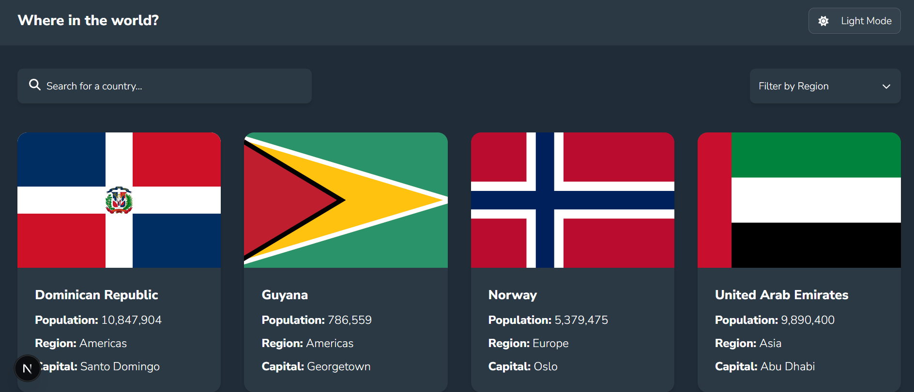
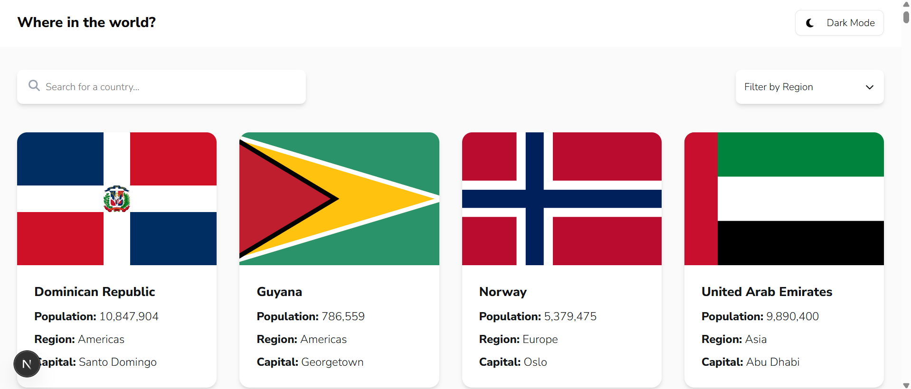
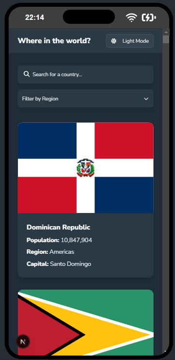

# 🌍 Country Explorer

**Desarrollado por Sara Lucía Duque Parra – Frontend Developer**

Aplicación interactiva para explorar países del mundo, con filtros por nombre y región, diseño responsivo y soporte para tema oscuro. Construida con **Next.js 15**, **React 19**, **TypeScript** y **TailwindCSS**.

---

## 📸 Pantallazos

### 🖥️ PC

- **Dark Mode**
  
- **Light Mode**
  

### 📱 Móvil

- **Dark Mode**
  
- **Light Mode**
  

---

## 🔧 Generalidades de la solución

El desarrollo del proyecto se llevó a cabo utilizando **Next.js 14 con la App Router**, haciendo uso de los componentes como `page.tsx` y `layout.tsx` para definir la estructura de navegación. A continuación, se describen las generalidades de cómo se resolvió el reto:

- Se integró la API de [restcountries.com](https://restcountries.com/) para obtener todos los datos de los países.
- Se implementó una **búsqueda por nombre** y **filtrado por región**, permitiendo una experiencia de usuario fluida y precisa.
- Se realizó navegación dinámica mediante `app/country/[code]/page.tsx`, permitiendo ver el detalle de cada país por su código.
- Se utilizó `shadcn/ui` y `lucide-react` para crear una interfaz moderna, accesible y con diseño responsivo.
- Se incorporó la tipografía **Nunito Sans** desde Google Fonts, siguiendo una paleta de colores basada en HSL.

### 🌙 Soporte de Dark Mode

- Se usó el paquete `next-themes` para detectar y alternar entre temas claro y oscuro.
- Se aplicaron clases condicionales de Tailwind (`dark:`) para cambiar los estilos según el tema actual, respetando el sistema del usuario.

### 🧪 Pruebas Unitarias

- Se configuró Jest y Testing Library para realizar pruebas de componentes clave como `CountryCard`, `SearchInput` y `RegionFilter`.
- Se añadieron mocks y casos de prueba que aseguran la correcta renderización, interactividad y respuesta de los componentes.


---

## 📁 Estructura del proyecto

La siguiente estructura se encuentra organizada bajo la carpeta principal `src/`, siguiendo principios de modularidad y separación de responsabilidades:

```bash
src/
├── app/
│   ├── favicon.ico
│   ├── globals.css
│   ├── layout.tsx
│   ├── page.tsx
│   └── country/
│       └── [code]/
│           └── page.tsx
│
├── components/
│   ├── CountryCard.tsx
│   ├── Header.tsx
│   ├── RegionFilter.tsx
│   ├── SearchInput.tsx
│   ├── ThemeToggle.tsx
│   └── ui/
│       ├── button.tsx
│       ├── card.tsx
│       ├── dropdown-menu.tsx
│       └── input.tsx
│
├── lib/
│   ├── api.ts
│   └── utils.ts
│
├── styles/
│   └── globals.css
│
├── tests/
│   ├── CountryCard.test.tsx
│   ├── RegionFilter.test.tsx
│   ├── SearchInput.test.tsx
│   └── global.d.ts
│
└── types/
    └── country.ts

```

---

## 🛠️ Tecnologías Utilizadas

A continuación se describen las tecnologías y versiones utilizadas en el proyecto, junto con su propósito:

- **React (v19.1.0)**  
  Se utilizó como librería principal para construir la interfaz de usuario, gracias a su eficiencia y enfoque declarativo.

- **React DOM (v19.1.0)**  
  Permite renderizar los componentes React en el DOM del navegador. Es esencial para que React funcione en entornos web.

- **Next.js (v15.3.5)**  
  Framework basado en React que proporciona renderizado del lado del servidor, rutas automáticas y optimizaciones como división de código. Facilitó el desarrollo rápido y estructurado.

- **TypeScript (v5.8.3)**  
  Se empleó para agregar tipado estático al código JavaScript, lo cual mejora la mantenibilidad, reduce errores y ayuda al desarrollo colaborativo.

- **Radix UI - Dropdown Menu (v2.1.15)**  
  Se utilizó para construir menús accesibles y con buena experiencia de usuario, como el filtro por región, sin necesidad de implementar lógica compleja desde cero.

- **Next Themes (v0.4.6)**  
  Proporciona una forma sencilla de implementar modo claro/oscuro, con persistencia automática del tema seleccionado por el usuario.

- **Lucide React (v0.525.0)**  
  Librería de iconos moderna y ligera, utilizada para mejorar la interfaz visual (por ejemplo, íconos de flechas o modo oscuro).

- **FontAwesome React (v0.2.2)**  
  Se usó para incluir algunos íconos adicionales con amplio reconocimiento visual, complementando el diseño.

- **Testing Library React (v16.3.0)**  
  Herramienta para escribir pruebas unitarias centradas en la experiencia del usuario. Ayuda a verificar que los componentes funcionen como se espera sin centrarse en su implementación interna.


---

## 🧪 Pruebas

Se incluyeron pruebas unitarias ubicadas en `src/tests/` para validar el comportamiento de los componentes clave:

- ✅ `CountryCard.test.tsx`: Verifica que se renderice la información del país.
- ✅ `SearchInput.test.tsx`: Asegura el correcto renderizado del input y el placeholder.
- ✅ `RegionFilter.test.tsx`: Simula la interacción con el dropdown y verifica llamadas a `onChange`.

Para ejecutar las pruebas:

```bash
npm run test

