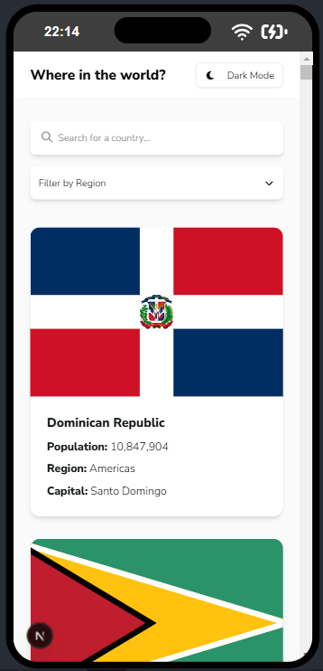

# 🌍 Country Explorer

**Desarrollado por Sara Lucía Duque Parra – Frontend Developer**

Aplicación interactiva para explorar países del mundo, con filtros por nombre y región, diseño responsivo y soporte para tema oscuro. Construida con **Next.js 15**, **React 19**, **TypeScript** y **TailwindCSS**.

---

## 📸 Pantallazos

### 🖥️ PC

- **Dark Mode**
  
- **Light Mode**
  

### 📱 Móvil

- **Dark Mode**
  
- **Light Mode**
  

---

## 🧩 Generalidades de la solución

Este proyecto fue desarrollado como solución a una prueba técnica frontend. Se priorizó:

- 🗺️ **Consumo de la API** pública `restcountries.com` para obtener información actualizada de todos los países.
- 🌓 **Experiencia de usuario** con dark mode y diseño responsivo para desktop y mobile.
- 🔍 **Búsqueda en tiempo real** por nombre del país y filtrado por región.
- 🔁 **Reutilización de componentes** como tarjetas de país, input de búsqueda, filtro de regiones y botón de cambio de tema.
- 💅 **Estilos modernos y personalizables** con TailwindCSS y `shadcn/ui`.
- 🧪 **Pruebas unitarias** con `Jest` y `@testing-library/react`, cubriendo los componentes principales.
- 🧩 **Arquitectura modular y escalable**, siguiendo buenas prácticas con separación de responsabilidades.

---

## 📁 Estructura del proyecto

La siguiente estructura se encuentra organizada bajo la carpeta principal `src/`, siguiendo principios de modularidad y separación de responsabilidades:

```bash
src/
├── app/
│   ├── favicon.ico
│   ├── globals.css
│   ├── layout.tsx
│   ├── page.tsx
│   └── country/
│       └── [code]/
│           └── page.tsx
│
├── components/
│   ├── CountryCard.tsx
│   ├── Header.tsx
│   ├── RegionFilter.tsx
│   ├── SearchInput.tsx
│   ├── ThemeToggle.tsx
│   └── ui/
│       ├── button.tsx
│       ├── card.tsx
│       ├── dropdown-menu.tsx
│       └── input.tsx
│
├── lib/
│   ├── api.ts
│   └── utils.ts
│
├── styles/
│   └── globals.css
│
├── tests/
│   ├── CountryCard.test.tsx
│   ├── RegionFilter.test.tsx
│   ├── SearchInput.test.tsx
│   └── global.d.ts
│
└── types/
    └── country.ts


---

## 🛠️ Tecnologías utilizadas

- [Next.js 15](https://nextjs.org/) – Framework de React para renderizado híbrido y rutas tipo file-system.
- [React 19](https://react.dev/) – Librería para construir interfaces interactivas.
- [TypeScript](https://www.typescriptlang.org/) – Tipado estático para mayor robustez y mantenimiento.
- [TailwindCSS](https://tailwindcss.com/) – Framework de utilidades para estilos CSS rápidos y personalizados.
- [shadcn/ui](https://ui.shadcn.com/) – Componentes accesibles y personalizables para React con Tailwind.
- [Font Awesome](https://fontawesome.com/) – Iconografía moderna y flexible.
- [Jest](https://jestjs.io/) – Framework de pruebas para JavaScript y TypeScript.
- [React Testing Library](https://testing-library.com/) – Testing orientado a comportamiento del usuario.

---

## 🧪 Pruebas

Se incluyeron pruebas unitarias ubicadas en `src/tests/` para validar el comportamiento de los componentes clave:

- ✅ `CountryCard.test.tsx`: Verifica que se renderice la información del país.
- ✅ `SearchInput.test.tsx`: Asegura el correcto renderizado del input y el placeholder.
- ✅ `RegionFilter.test.tsx`: Simula la interacción con el dropdown y verifica llamadas a `onChange`.

Para ejecutar las pruebas:

```bash
npm run test

